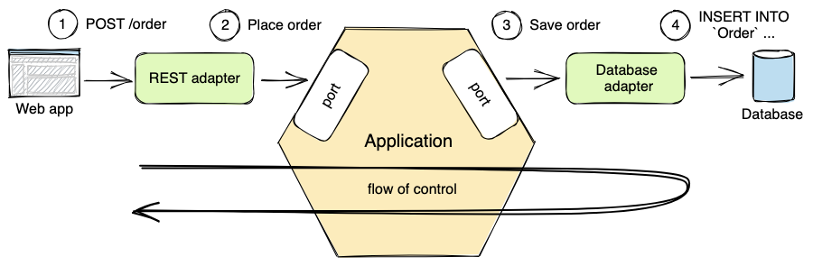
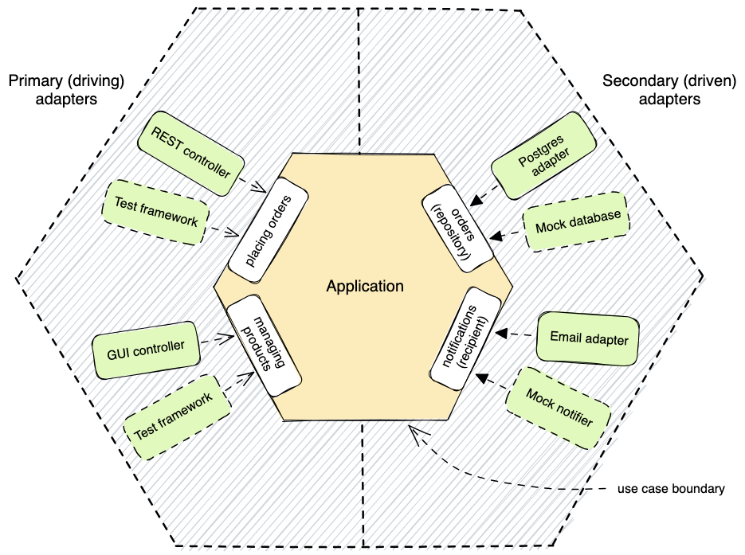
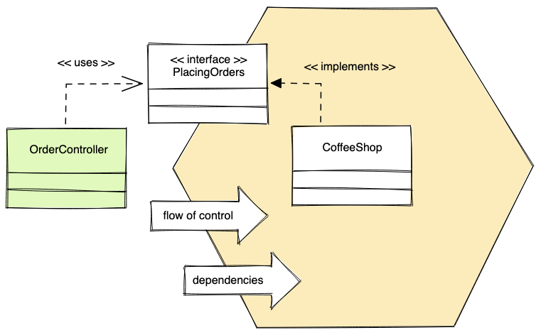
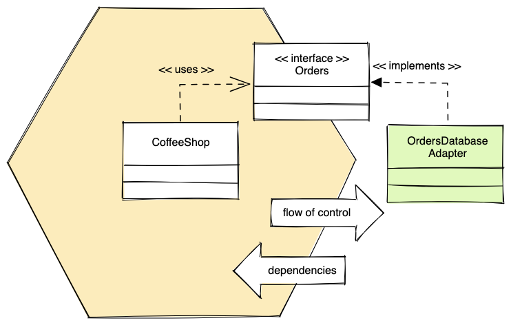

# Hexagonal Architecture With Spring Boot

Hexagonal architecture has become a popular architectural pattern for separating business logic from
the infrastructure. This separation allows us to delay decisions about technology or easily replace
technologies. It also makes it possible to test the business logic in isolation from external
systems.

[Hexagonal Architecture Explained](https://www.arhohuttunen.com/hexagonal-architecture)

For example, in a coffee shop application, there could be a point of sale UI which handles taking
orders
for coffee. When the barista submits an order, a REST adapter takes the HTTP POST request and
translates
it to the form understood by a port. Calling the port triggers the business logic related to placing
the order inside the application. The application itself doesn’t know that it is being operated
through a REST API.

## Primary and Secondary Adapters

As we have seen, some adapters invoke use cases of the application, while some others react to
actions triggered by the application. The adapters that control the application are called primary
or driving adapters, usually drawn to the left side of the diagram. The adapters that are controlled
by the application are called secondary or driven adapters, usually drawn to the right of the
diagram.

## Implementation

So far, we have only stated that the technical details should stay outside the application. The
communication between the adapters and the application should only happen through ports. Let’s look
at what this means in practice.

### Dependency Inversion

When we implement a primary adapter on the driver side, an adapter has to tell the application to do
something. The flow of control goes from the adapter to the application through ports. The
dependency between the adapter and application points inwards, making the application unaware of who
is calling its use cases.

In our case, this is a fancy way of saying the application should not directly depend on the
database adapter. Instead, the application should use a port, and the adapter should then implement
that port.

